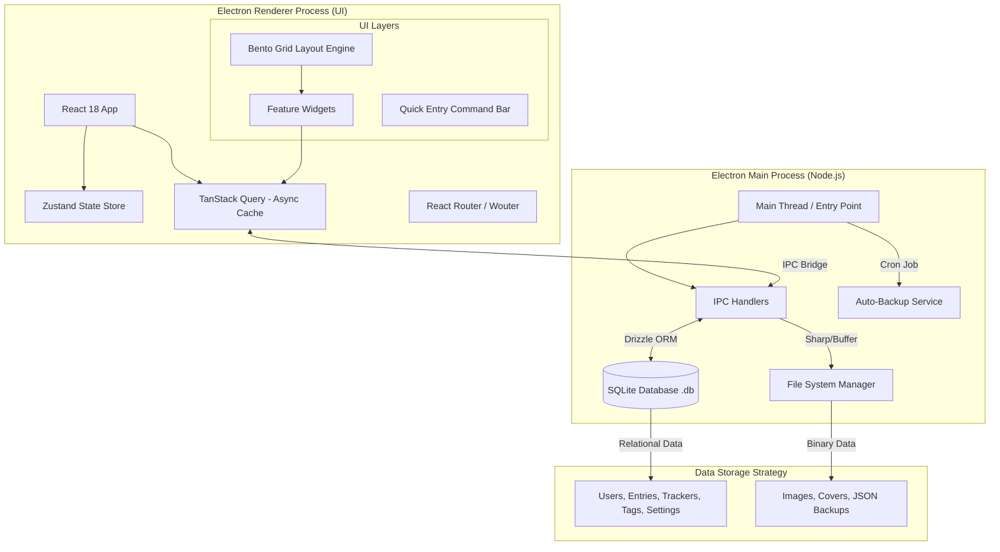

Este es un plan técnico detallado, diseñado desde la perspectiva de un Arquitecto de Software Senior, para refactorizar y escalar la aplicación "Chimero" (Habit Flow), alineado con los requisitos de privacidad, rendimiento local y estabilidad solicitados.

### Análisis Preliminar de Archivos y Requisitos

He analizado `CLIENT_CHAT.MD`, `APP.md` y `DOCUMENTATION.md`. Aquí el desglose de la situación actual y la meta:

* **Estado Actual:** MVP funcional construido sobre Next.js/Electron. Utiliza un sistema de archivos/JSON simulando una base de datos (`stats-service.ts`), lo que causa los cuellos de botella de rendimiento (500ms compile) y limita las consultas complejas (correlaciones). La UI sigue un patrón "Bento Grid" validado por el cliente.
* **Requisitos Críticos:**
* **Privacidad:** 100% Local (Offline-first).
* **Data-Heavy:** El cliente quiere registrar *todo* (media, peso, tareas, mood múltiple al día, social).
* **Consultas Avanzadas:** "Última vez que comí X", correlaciones (Mood vs Sueño), rachas anuales. Esto es inviable con JSON plano a largo plazo; requiere SQL.
* **UX:** Dashboard personalizable (Drag & drop), Dark theme, Quick Entry (prioridad alta).

---

### 1. Diagrama de Arquitectura (Mermaid)

Esta arquitectura desacopla la UI de la lógica de datos, utilizando IPC (Inter-Process Communication) para mantener la UI fluida mientras Node.js maneja la base de datos pesada.

---

### 2. Stack Tecnológico Recomendado

Para un "rewrite" que garantice <100ms de carga y estabilidad a largo plazo, recomiendo abandonar Next.js (que añade overhead de servidor innecesario para una app puramente local) y usar **Vite + React (SPA)**.

* **Core & Build:**
* **Electron (v28+):** Última versión estable.
* **Vite:** Build tool ultra-rápido. Reemplaza a Webpack/Next.js compiler. Tiempos de HMR casi instantáneos.
* **TypeScript:** Modo estricto obligatorio para evitar la deuda técnica actual.

* **Frontend (Renderer):**
* **Framework:** **React 18**.
* **Routing:** **TanStack Router** o **React Router 6**. (TanStack Router ofrece type-safety en rutas, ideal para apps complejas).
* **Estado UI:** **Zustand**. Minimalista, sin boilerplate (mejor que Redux para esto). Manejará el estado del Drag & Drop y configuraciones globales.
* **Data Fetching:** **TanStack Query (React Query)**. CRUCIAL. Maneja caché, reintentos y estados de carga entre la UI y SQLite.
* **UI/Estilos:** **Tailwind CSS** (ya validado) + **Radix UI** (primitivos accesibles sin estilos para construir los menús/popovers robustos) + **Framer Motion** (animaciones fluidas de layout).
* **Gráficos:** **Recharts** o **Visx**. Optimizados para React y data-heavy visualization.

* **Backend (Main Process - Local):**
* **Base de Datos:** **SQLite** (vía `better-sqlite3`). Es síncrono/rápido para lecturas locales y no requiere instalación de servidor.
* **ORM:** **Drizzle ORM**. Mucho más ligero y rápido en arranque que Prisma. Tipado fuerte y excelente soporte para migraciones SQL.
* **Validación:** **Zod**. Para validar datos antes de que toquen la DB o salgan de los formularios.

* **DevOps & Calidad:**
* **Linting:** ESLint + Prettier.
* **Testing:** **Vitest** (Unit/Integration - más rápido que Jest) + **Playwright** (E2E para probar flujos completos de Electron).
* **Packaging:** **electron-builder**. Configurado para generar `.exe` (Win) y `.dmg` (Mac).

---

### 3. Lista Priorizada de Mejoras vs. MVP Actual

Aquí transformamos las quejas del cliente (`CLIENT_CHAT.MD`) en soluciones técnicas.

1. **Migración de JSON a SQLite (Modelo Relacional):**
* *Justificación:* El MVP usa archivos planos/JSON. Esto hace imposible consultas como "cuántas veces hice X el año pasado" sin cargar todo en memoria. SQLite permite índices y `JOINs`.
* *Impacto:* Rendimiento O(1) vs O(N) en búsquedas. Escalabilidad infinita.

2. **Arquitectura "Optimistic Updates" para Quick Entry:**
* *Justificación:* El cliente menciona "wait manual and quick entry". La UI debe actualizarse *instantáneamente* al dar Enter, mientras la DB guarda en segundo plano.
* *Impacto:* Sensación de velocidad "nativa" (<16ms respuesta visual).

3. **Motor SQL para Estadísticas y Correlaciones:**
* *Justificación:* El cliente pide correlaciones (ej. Sueño vs Humor). En lugar de calcular esto en JS (lento), usaremos funciones matemáticas de SQL o extensiones de SQLite para calcular promedios, desviaciones y correlaciones directamente en la consulta.
* *Impacto:* Dashboards que cargan en milisegundos incluso con años de datos.

4. **Sistema de Widgets con "Lazy Loading" y Virtualización:**
* *Justificación:* El problema de "overflow web" y lentitud. Los widgets fuera de pantalla no deben renderizar sus gráficos pesados. Las listas largas (historial) deben usar `TanStack Virtual`.
* *Impacto:* Uso de RAM constante, sin importar si hay 100 o 10,000 entradas.

5. **Refactorización de "Custom Trackers" a Esquema EAV o JSONB:**
* *Justificación:* El cliente quiere trackers personalizados flexibles. En SQL rígido es difícil. Usaremos una columna `JSONB` en SQLite para guardar atributos dinámicos de trackers custom sin romper el esquema.
* *Impacto:* Crear nuevos tipos de trackers sin migraciones de base de datos.

6. **Gestión de Activos (Media) con Thumbnails Locales:**
* *Justificación:* `app/assets` carga imágenes completas. Esto es lento. Implementar `sharp` en el proceso Main para generar miniaturas al subir imágenes y servir solo esas en la galería.
* *Impacto:* Carga de galería instantánea y reducción drástica de uso de memoria.

7. **Drag & Drop Persistente y Robusto:**
* *Justificación:* Usar `dnd-kit` (más moderno que react-beautiful-dnd) para el dashboard tipo Bento. Guardar coordenadas (X, Y, W, H) en DB inmediatamente al soltar.
* *Impacto:* Elimina los bugs visuales y conflictos de layout mencionados en la documentación.

8. **Modo Oscuro Real (System-based & Low Contrast):**
* *Justificación:* Requisito explícito de "low contrast". Configurar Tailwind con variables CSS nativas que respondan a la configuración de la DB/Sistema.
* *Impacto:* Confort visual y cumplimiento de requisito estético del cliente.

9. **Backups Automáticos y Exportación:**
* *Justificación:* Al ser "Local Only", si el PC muere, los datos mueren. Implementar un cron interno que copie el `db.sqlite` a una carpeta de backup cada X horas.
* *Impacto:* Seguridad de datos sin nube.

10. **Testing E2E Automatizado (CI):**
* *Justificación:* "Fix errors that may cause crashes later". Playwright abrirá la app compilada, hará click en "Add Task", y verificará que aparezca.
* *Impacto:* Estabilidad garantizada antes de enviar el update al cliente.

---

### 4. Roadmap Técnico (Sprints de 1 Semana)

Asumiendo un desarrollador Senior dedicado.

#### **Semana 1: Cimientos y Datos (The Engine)** ✅ COMPLETED

* **Objetivo:** Tener Electron corriendo con SQLite y el esquema de base de datos validado.
* **Tareas:**
* [x] Inicializar repositorio Monorepo (Turborepo opcional) o estructura limpia Vite+Electron.
* [x] **Diseño de Schema Drizzle:** Tablas para `settings`, `Trackers`, `Entries`, `Tags`, `Assets`.
* *Detalle:* Tabla `Entries` unificada con `trackerId`, `value`, `metadata` JSON, `dateStr` para agrupaciones SQL.
* [x] Implementar IPC Bridge seguro (Context Isolation enabled).

#### **Semana 2: Core Features & Quick Entry (The Input)** ✅ COMPLETED (Autocomplete pendiente → carryover)

* **Objetivo:** El usuario puede meter datos de forma ultra-rápida.
* **Tareas:**
* [x] Desarrollar componente `QuickEntry` (tipo Spotlight/CommandBar - `Ctrl+K`).
* [x] Implementar lógica de Backend para: Tareas, Peso, Mood (1-10 multi-entry), Media.
* [x] CRUD básico en UI (sin drag & drop complejo aún, solo formularios funcionales).
* [ ] Sistema de Autocompletado (Recent/Favorites) consultando SQLite — *en ejecución*. (Need the backend (Crud system for trackers) for testing)

#### **Semana 3: Dashboard & Visualización (The View)** 🔄 IN PROGRESS / HIGH PRIORITY

* **Objetivo:** Recrear el "Bento Grid" pero optimizado.
* **Tareas:**
* [ ] Implementar `dnd-kit` para el Grid Layout (persistencia de orden). (I think this's done)
* [ ] Crear Widgets individuales:
* *Mood Graph:* Gráfico de líneas (Recharts) con agregación diaria SQL.
* *Tasks:* Lista virtualizada con checkbox.
* *Media:* Grid de portadas con lazy loading.
* [ ] Conectar Widgets a TanStack Query (auto-refresco al cambiar DB). (I think this's done too)
* [ ] Implementar sistema de Themes (Dark/Low-contrast).

#### **Semana 4: Analytics & Polish (The Value)** — Scope reducido para MVP

* **Objetivo:** Pulido final y preparación de valor entregable.
* **Tareas:**
* [ ] Pulido de UI: Animaciones de entrada, tooltips, manejo de errores.

---

### 5. Post-MVP / Optimization Phase

Elementos diferidos para una fase posterior (no prioritarios en el MVP actual):

* [ ] **GitHub Actions:** Lint, Build, Test en CI.
* [ ] **Tests unitarios:** Zustand/Zod, lógica de inserción y validación.
* [ ] **electron-builder:** Packaging, firma de código, builds portables.
* [ ] **Backups automáticos** locales.
* [ ] **Playwright E2E:** Flujo crítico (Abrir app → Crear Tarea → Ver en Dashboard).
* [ ] **Estadísticas avanzadas:** Correlaciones (Pearson), Rachas (Streaks).

Este plan preserva la esencia visual que el cliente aprobó en el MVP, pero reemplaza el motor interno "de juguete" (JSON) por uno de "grado industrial" (SQLite + Electron optimizado), asegurando la escalabilidad y velocidad que busca.

The project uses PNPM and the terminal uses POWERSHELL